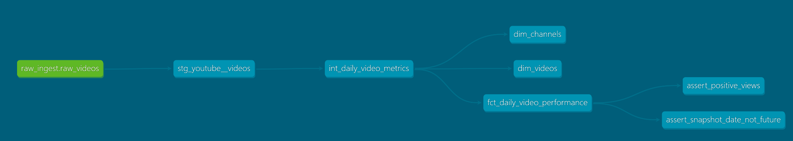
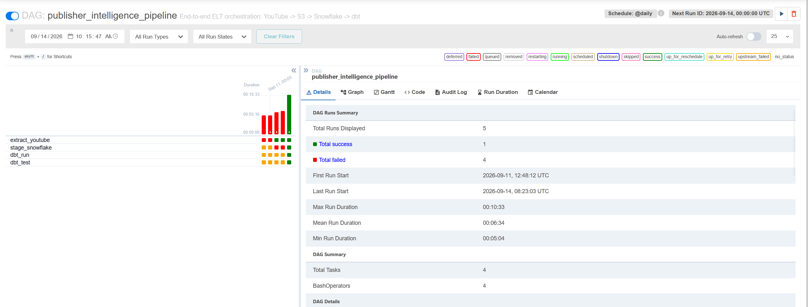

# Digital Publisher Content Intelligence Pipeline

[](https://github.com/chanethan408/publisher-intelligence-pipeline/actions/workflows/ci.yml)
[](https://www.python.org/)
[](https://www.getdbt.com/)
[](https://www.snowflake.com/)
[](https://airflow.apache.org/)
[](https://www.docker.com/)

An automated, end-to-end ELT data pipeline engineered to collect digital publisher video telemetry via the YouTube Data API v3, persist immutable raw records in Amazon S3, stage and transform dimensional models in Snowflake using dbt Core, and orchestrate daily scheduled executions via Dockerized Apache Airflow.

---

## Architecture Overview

```mermaid
flowchart LR
    subgraph Ingestion [Extraction & Raw Landing]
        A[YouTube Data API v3] -->|Python Extractor| B[(Amazon S3 Raw Lake)]
    end

    subgraph Data Warehouse [Snowflake Cloud DWH]
        B -->|External Stage / COPY INTO| C[(RAW_INGEST.RAW_VIDEOS)]
        C -->|dbt View| D[STAGING.stg_youtube__videos]
        D -->|dbt View| E[INTERMEDIATE.int_daily_video_metrics]
        E -->|dbt Table| F[MARTS.DIM_CHANNELS]
        E -->|dbt Table| G[MARTS.DIM_VIDEOS]
        E -->|dbt Incremental Merge| H[MARTS.FCT_DAILY_VIDEO_PERFORMANCE]
    end

    subgraph Orchestration & CI [Orchestration & Verification]
        I[Dockerized Apache Airflow] -.->|Extract >> Stage >> dbt Run >> dbt Test| Data Warehouse
        J[GitHub Actions CI] -.->|Black / Flake8 / SQLFluff / dbt Parse| Orchestration
    end
```

---

## Production Pipeline Metrics

Verified row counts from completed Airflow pipeline executions:

| Metric Layer | Object Name | Verified Record Count | Description |
| :--- | :--- | :--- | :--- |
| **Raw Telemetry** | `RAW_INGEST.RAW_VIDEOS` | **6,933** | Immutable raw JSON payloads staged from Amazon S3 |
| **Dimensional Channels** | `MARTS.DIM_CHANNELS` | **3** | Curated publisher channel dimension records |
| **Dimensional Videos** | `MARTS.DIM_VIDEOS` | **6,932** | Deduplicated video entities across all snapshot runs |
| **Fact Snapshots** | `MARTS.FCT_DAILY_VIDEO_PERFORMANCE` | **6,931** | Daily incremental performance snapshots at `(video_id, snapshot_date)` grain |

---

## Technical Highlights & Engineering Decisions

* **Cloud Storage & Raw Landing:** Serializes raw API responses to gzip-compressed JSON in date-partitioned Hive paths (`s3://<bucket>/raw/entity=videos/date=YYYY-MM-DD/payload_<timestamp>.json.gz`). S3 serves as an immutable lake, preserving raw states for full auditability, replaying, and backfills without burning API quota.
* **IAM AssumeRole Integration:** Configured a Snowflake Storage Integration via AWS IAM `sts:AssumeRole`, removing the need for static, hardcoded AWS keys in database metadata. Warehouse operations are isolated to an automated `AIRFLOW_LOAD_ROLE` and `PUBLISHER_LOADER` service user using 2048-bit RSA keypair authentication.
* **Idempotent Ingestion & Transformation:**
  * **Physical Staging:** Relies on Snowflake load history tracking to prevent duplicate ingestion of staged files during task retries.
  * **Logical Staging:** Applies `QUALIFY ROW_NUMBER() OVER (PARTITION BY video_id, snapshot_date ORDER BY ingested_at DESC) = 1` in `stg_youtube__videos` so intraday pipeline reruns only materialize the latest payload.
  * **Incremental Fact Merge:** Builds `fct_daily_video_performance` via dbt's `incremental` materialization using a `merge` strategy on the composite primary key `['video_id', 'snapshot_date']`.
* **2-Day Incremental Lookback:** The fact model filters source data using `snapshot_date >= dateadd('day', -2, (select max(snapshot_date) from {{ this }}))` to capture restatements and late-arriving metrics while capping compute scan costs.
* **Data Quality Gates:** Implements 9 automated dbt tests validating referential integrity (`relationships`), non-null constraints, unique surrogate keys (`MD5` hashes), and business invariants (non-negative daily and cumulative view counts, no future snapshot dates).
* **Automated CI Validation:** GitHub Actions executes on every push and pull request to validate code style (`black`, `flake8`, `sqlfluff`) and verify dbt project syntax (`dbt parse`) against a mock connection profile.

---

## Lineage & Orchestration Proof

### dbt Model Lineage DAG
End-to-end transformation DAG displaying the staging, intermediate, mart, and testing layers:



### Airflow Orchestration DAG
Four-stage sequential DAG (`extract_youtube` → `stage_snowflake` → `dbt_run` → `dbt_test`) scheduled and verified in Airflow:



---

## Analytical Query & Insights

Downstream analytics and business intelligence tools consume directly from the curated dimensional marts:

```sql
-- Top videos by daily view velocity on the latest snapshot date
SELECT
    v.video_title,
    c.channel_title,
    f.daily_views,
    f.cumulative_views,
    f.engagement_rate_pct
FROM PUBLISHER_DWH.MARTS.FCT_DAILY_VIDEO_PERFORMANCE f
JOIN PUBLISHER_DWH.MARTS.DIM_VIDEOS v ON f.video_id = v.video_id
JOIN PUBLISHER_DWH.MARTS.DIM_CHANNELS c ON f.channel_id = c.channel_id
WHERE f.snapshot_date = (SELECT MAX(snapshot_date) FROM PUBLISHER_DWH.MARTS.FCT_DAILY_VIDEO_PERFORMANCE)
ORDER BY f.daily_views DESC
LIMIT 5;
```

---

## Project Structure

```text
publisher-intelligence-pipeline/
├── .github/workflows/ci.yml           # Automated Black, Flake8, SQLFluff, dbt CI
├── config/channels.json               # Target YouTube channel identifiers
├── dags/
│   └── publisher_intelligence_dag.py  # Daily Airflow DAG definition
├── dbt_publisher_intel/
│   ├── models/
│   │   ├── staging/                   # Source definitions and raw JSON parsing
│   │   ├── intermediate/              # Daily metric deltas and ratio calculations
│   │   └── marts/                     # Star-schema dimensions and incremental fact
│   ├── tests/                         # Singular business rule SQL tests
│   └── dbt_project.yml
├── docs/                              # Architecture artifacts & DAG screenshots
├── src/
│   ├── extract/                       # YouTube API extractor and S3 client
│   ├── load/                          # Snowflake COPY INTO staging loader
│   ├── sql/01_snowflake_setup.sql     # Snowflake DDL, stages, and RBAC script
│   └── utils/logger.py                # Structured JSON logging
├── tests/                             # Unit tests for extract and load modules
├── docker-compose.yml                 # Airflow, Postgres, and volume definitions
└── Dockerfile                         # Custom Airflow container with dbt & requirements
```

---

## Local Setup & Execution

### Prerequisites
* Docker Desktop & Docker Compose
* Python 3.11+
* AWS Account (S3 bucket and IAM permissions)
* Snowflake Account with `ACCOUNTADMIN` access

### 1. Repository & Virtual Environment
```bash
git clone [https://github.com/chanethan408/publisher-intelligence-pipeline.git](https://github.com/chanethan408/publisher-intelligence-pipeline.git)
cd publisher-intelligence-pipeline
python -m venv .venv
source .venv/bin/activate  # Windows: .venv\Scripts\activate
pip install -r requirements.txt
```

### 2. Environment & Key Configuration
1. Copy the example configuration:
   ```bash
   cp .env.example .env
   ```
2. Generate an RSA keypair for Snowflake authentication:
   ```bash
   openssl genrsa 2048 | openssl pkcs8 -topk8 -inform PEM -out snowflake_key.p8 -nocrypt
   openssl rsa -in snowflake_key.p8 -pubout -out snowflake_key.pub
   ```
3. Execute `src/sql/01_snowflake_setup.sql` in Snowflake Snowsight to provision databases, schemas, stages, service accounts, and RBAC roles.
4. Add your API keys, S3 bucket name, and Snowflake configuration parameters to `.env`.

### 3. Launch Dockerized Airflow
```bash
docker compose up -d
```
Access the Airflow web interface at `http://localhost:8080` (`admin` / `admin`) and manually trigger or inspect the `publisher_intelligence_pipeline` DAG.