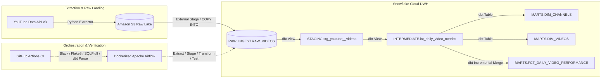

# Digital Publisher Content Intelligence Pipeline

[](https://github.com/chanethan408/publisher-intelligence-pipeline/actions/workflows/ci.yml)
[](https://www.python.org/)
[](https://www.getdbt.com/)
[](https://www.snowflake.com/)
[](https://airflow.apache.org/)
[](https://www.docker.com/)

An automated, end-to-end ELT data pipeline engineered to collect digital publisher video telemetry via the YouTube Data API v3, persist immutable raw records in Amazon S3, stage and transform dimensional models in Snowflake using dbt Core, and orchestrate automated daily runs via Dockerized Apache Airflow.

---

## Architecture Overview



---

## Production Pipeline Metrics

The following metrics reflect verified production runs loaded through the Airflow orchestration DAG:

| Metric Layer | Object Name | Verified Record Count | Description |
| :--- | :--- | :--- | :--- |
| **Raw Telemetry** | `RAW_INGEST.RAW_VIDEOS` | **47,304** | Immutable raw JSON payloads staged from Amazon S3 |
| **Dimensional Channels** | `MARTS.DIM_CHANNELS` | **16** | Curated publisher channel dimension records |
| **Dimensional Videos** | `MARTS.DIM_VIDEOS` | **40,365** | Deduplicated video entities across all snapshot runs |
| **Fact Snapshots** | `MARTS.FCT_DAILY_VIDEO_PERFORMANCE` | **47,295** | Daily incremental performance snapshots at `(video_id, snapshot_date)` grain |

---

## Pipeline Lineage & Orchestration

### dbt Dimensional Lineage DAG
The end-to-end transformation flow models raw JSON payloads through a 3-tier architecture into tested dimensional and fact tables:


### Airflow Orchestration DAG
Automated daily execution scheduled and orchestrated end-to-end via Apache Airflow:


---

## Technical Highlights & Engineering Decisions

* **Cloud Storage & Immutable Landing:** Raw YouTube Data API responses are serialized to gzip-compressed JSON and uploaded to Amazon S3 using a date-partitioned Hive path format (`s3://<bucket>/raw/entity=videos/date=YYYY-MM-DD/payload_<timestamp>.json.gz`). S3 serves as an immutable data lake, preserving raw telemetry states and allowing complete auditability, replaying, and backfills without consuming API quota.
* **Snowflake Security & RBAC:** Ingestion uses AWS IAM AssumeRole via a Snowflake Storage Integration (`sts:AssumeRole`), eliminating hardcoded AWS credentials in the warehouse. Automated operations are isolated to a dedicated `AIRFLOW_LOAD_ROLE` and `PUBLISHER_LOADER` service user authenticated via 2048-bit RSA keypair.
* **Idempotency & Deduplication Strategy:**
  * **Physical Ingestion:** Snowflake's built-in file load history prevents duplicate physical file loads during standard task retries.
  * **Logical Staging:** The staging layer enforces deduplication via `QUALIFY ROW_NUMBER() OVER (PARTITION BY video_id, snapshot_date ORDER BY ingested_at DESC) = 1`, ensuring retried Airflow tasks on the same calendar day promote only the latest state.
  * **Incremental Merge:** The fact model (`fct_daily_video_performance`) uses dbt's incremental materialization with a merge strategy on composite unique key `['video_id', 'snapshot_date']`.
* **2-Day Incremental Lookback:** The incremental fact model filters on `snapshot_date >= dateadd('day', -2, (select max(snapshot_date) from {{ this }}))`, accommodating late-arriving metrics and restatements while bounding compute scan costs.
* **Data Quality Gates:** 9 automated dbt tests enforce referential integrity (`relationships`), non-null constraints, unique surrogate keys (`MD5` hashes), and business invariants (non-negative cumulative and delta views, no future snapshot dates).
* **Automated CI/CD Validation:** GitHub Actions runs on every push and pull request to execute code formatting (`black`), Python linting (`flake8`), SQL styling (`sqlfluff`), and dbt compilation/graph parsing (`dbt parse`) using a mock profile.

---

## Data Modeling & Transformation Layers

The dbt project organizes transformations into three distinct layers:

1. **Staging (`STAGING.stg_youtube__videos`):**
   * Parses the raw `VARIANT` JSON payload.
   * Standardizes data types (timestamps, integer counts, string identifiers).
   * Filters invalid records and deduplicates multiple daily extracts.
2. **Intermediate (`INTERMEDIATE.int_daily_video_metrics`):**
   * Applies the `LAG()` analytic function ordered by `snapshot_date` to compute true daily metric deltas (`daily_views`, `daily_likes`, `daily_comments`).
   * Computes engagement ratios with zero-division protection via `NULLIF()`.
3. **Marts Schema (`MARTS`):**
   * `DIM_CHANNELS`: Curated publisher channel attributes.
   * `DIM_VIDEOS`: Dimensional video entity catalog with publish timestamps and titles.
   * `FCT_DAILY_VIDEO_PERFORMANCE`: Incremental fact table tracking daily video performance snapshots with deterministic surrogate primary keys (`performance_pk`).

---

## Analytical Queries & Business Insights

Downstream analytics and business intelligence tools consume directly from the curated `MARTS` schema:

### 1. Top Videos by Daily View Velocity
Identifies the highest-performing content on the most recent snapshot date:

```sql
SELECT
    v.video_title,
    c.channel_title,
    f.daily_views,
    f.cumulative_views,
    f.engagement_rate_pct
FROM PUBLISHER_DWH.MARTS.FCT_DAILY_VIDEO_PERFORMANCE f
JOIN PUBLISHER_DWH.MARTS.DIM_VIDEOS v ON f.video_id = v.video_id
JOIN PUBLISHER_DWH.MARTS.DIM_CHANNELS c ON f.channel_id = c.channel_id
WHERE f.snapshot_date = (SELECT MAX(snapshot_date) FROM PUBLISHER_DWH.MARTS.FCT_DAILY_VIDEO_PERFORMANCE)
ORDER BY f.daily_views DESC
LIMIT 5;
```


### 2. Channel Engagement & Aggregate Reach
Compares publisher channel performance, calculating aggregate engagement rates and cumulative reach:

```sql
SELECT
    c.channel_title,
    COUNT(DISTINCT f.video_id) AS active_videos,
    SUM(f.daily_views) AS total_daily_views,
    ROUND(AVG(f.engagement_rate_pct), 3) AS avg_engagement_rate_pct,
    SUM(f.cumulative_views) AS total_channel_views
FROM PUBLISHER_DWH.MARTS.FCT_DAILY_VIDEO_PERFORMANCE f
JOIN PUBLISHER_DWH.MARTS.DIM_CHANNELS c ON f.channel_id = c.channel_id
WHERE f.snapshot_date = (SELECT MAX(snapshot_date) FROM PUBLISHER_DWH.MARTS.FCT_DAILY_VIDEO_PERFORMANCE)
GROUP BY c.channel_title
ORDER BY total_daily_views DESC;
```


---

## Project Structure

```text
publisher-intelligence-pipeline/
├── .github/
│   └── workflows/
│       └── ci.yml                     # Automated Black, Flake8, SQLFluff, dbt CI
├── config/
│   └── channels.json                  # Target YouTube channel identifiers
├── dags/
│   └── publisher_intelligence_dag.py  # Daily Airflow DAG definition
├── dbt_publisher_intel/
│   ├── models/
│   │   ├── staging/                   # Source definitions and raw JSON parsing
│   │   ├── intermediate/              # Daily metric deltas and ratio calculations
│   │   └── marts/                     # Star-schema dimensions and incremental fact
│   ├── tests/                         # Singular data quality SQL tests
│   └── dbt_project.yml
├── docs/
│   ├── airflow_dag_success.png        # Airflow verification screenshot
│   └── dbt_lineage_graph.png          # dbt lineage graph screenshot
├── src/
│   ├── extract/
│   │   ├── youtube_client.py          # YouTube Data API v3 extractor
│   │   └── s3_uploader.py             # S3 upload with Gzip compression
│   ├── load/
│   │   └── stage_snowflake.py         # Snowflake COPY INTO staging loader
│   ├── sql/
│   │   └── 01_snowflake_setup.sql     # Snowflake DDL and RBAC setup script
│   └── utils/
│       └── logger.py                  # Structured JSON logger
├── tests/                             # Unit tests for extract and load modules
├── docker-compose.yml                 # Airflow, Postgres, and volume definitions
├── Dockerfile                         # Custom Airflow container with dbt & requirements
└── README.md
```


---

## Local Setup & Quickstart

### Prerequisites
* Docker Desktop and Docker Compose
* Python 3.11+
* AWS Account with S3 and IAM access
* Snowflake Account with ACCOUNTADMIN role

### 1. Clone Repository & Setup Virtual Environment
```bash
git clone [https://github.com/chanethan408/publisher-intelligence-pipeline.git](https://github.com/chanethan408/publisher-intelligence-pipeline.git)
cd publisher-intelligence-pipeline
python -m venv .venv
source .venv/bin/activate  # Windows: .venv\Scripts\activate
pip install -r requirements.txt
```


### 2. Environment Configuration
Copy the template configuration file:
```bash
cp .env.example .env
```

Populate `.env` with your YouTube API Key, AWS S3 bucket and credentials, and Snowflake account details.

### 3. Generate Snowflake RSA Keypair
```bash
openssl genrsa 2048 | openssl pkcs8 -topk8 -inform PEM -out snowflake_key.p8 -nocrypt
openssl rsa -in snowflake_key.p8 -pubout -out snowflake_key.pub
```

Run `src/sql/01_snowflake_setup.sql` in Snowflake to provision the database, schemas, warehouse, roles, and user key authentication.

### 4. Run Pipeline Orchestration via Docker
Launch the containerized Airflow stack:
```bash
docker compose up -d
```

Access the Airflow UI at `http://localhost:8080` (credentials: `admin` / `admin`) and trigger `publisher_intelligence_pipeline`.